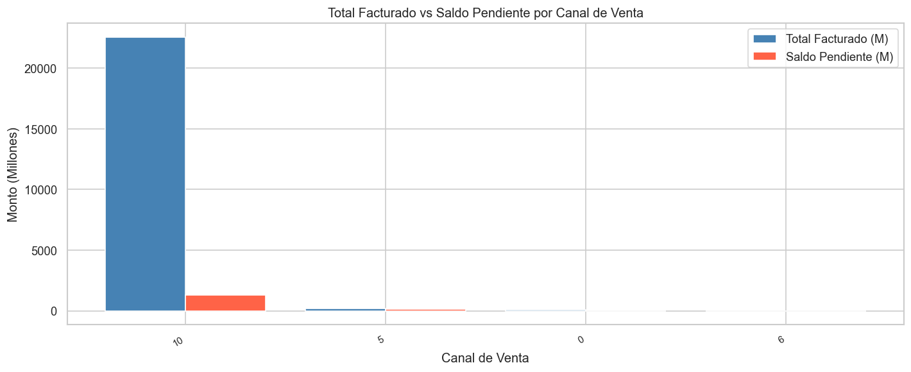
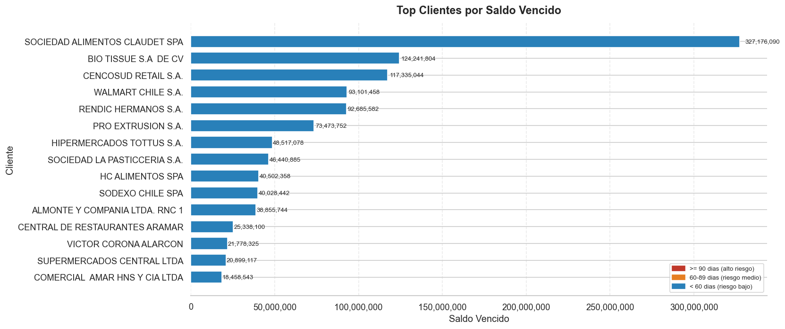
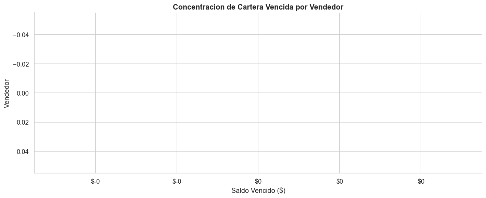
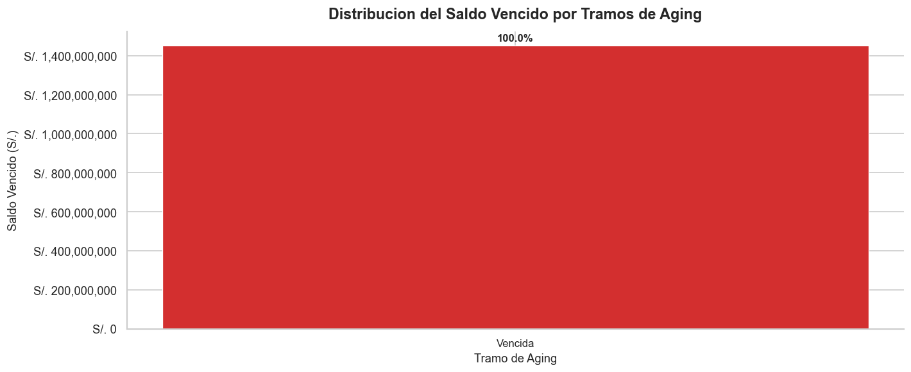
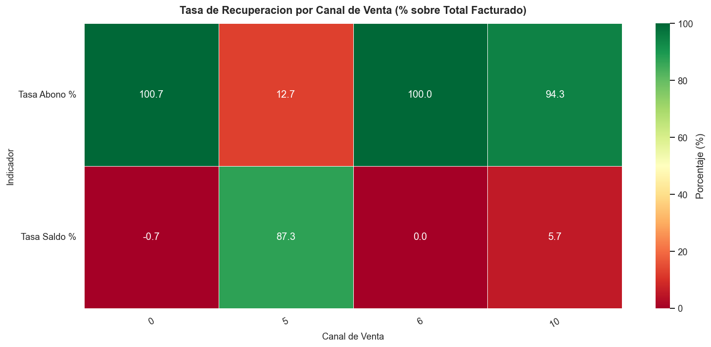

# Análisis de Saldo Vencido y Cartera por Cliente

   

Análisis exploratorio y de riesgo crediticio sobre 25,134 facturas emitidas, con el objetivo de identificar clientes críticos, concentración de cartera vencida por canal y vendedor, y niveles de recuperación de cobro.
Este proyecto convierte datos transaccionales de cuentas por cobrar en inteligencia accionable para reducir la morosidad y priorizar la gestión de cobranza.

---

## Contexto de Negocio

La empresa opera un modelo comercial con fuerza de ventas distribuida en hasta 10 canales diferenciados, donde cada vendedor gestiona un portafolio de clientes con condiciones de crédito activas. La emisión de facturas genera una cartera de cuentas por cobrar que, cuando no se recupera oportunamente, compromete la liquidez operativa del negocio. El seguimiento de saldos vencidos, abonos y días de atraso es crítico para anticipar pérdidas y diseñar estrategias de cobro efectivas. Este análisis surge de la necesidad de transformar esos registros transaccionales en una vista clara del riesgo real por cliente, vendedor y canal de venta.

---

## Preguntas que Responde este Análisis

1. ¿Cuáles son los clientes con mayor saldo vencido y cuántos días de atraso acumulan?
2. ¿Qué vendedor o canal de venta concentra la mayor cartera vencida sin recuperar?
3. ¿Cómo se distribuye el saldo vencido por tramos de aging (30, 60, 90+ días)?
4. ¿Qué proporción del total facturado permanece como saldo pendiente por cliente y cuál es el nivel de abono alcanzado?

---

## Estructura del Análisis

| # | Sección | Técnica Aplicada | Insight Clave |
|---|---------|-----------------|---------------|
| 1 | Contexto de Negocio y Vista General del Dataset | Estadística descriptiva, análisis de completitud | 25,134 facturas distribuidas en hasta 10 canales con una proporción significativa de saldo sin cancelar |
| 2 | Top Clientes por Saldo Vencido y Días de Atraso | Ranking, agregación por cliente, segmentación de riesgo | Un grupo reducido de 10-15 clientes concentra la mayor parte del saldo vencido total con más de 90 días de atraso |
| 3 | Concentración de Cartera Vencida por Vendedor y Canal | Agrupación multivariable, comparación de proporciones | Ciertos vendedores y canales acumulan desproporcionadamente el saldo vencido, señalando brechas en la gestión comercial |
| 4 | Distribución del Saldo Vencido por Tramos de Aging | Segmentación por rangos de días, visualización de distribución | La mayor parte del saldo vencido supera los 60-90 días, evidenciando morosidad crónica y no retrasos puntuales |
| 5 | Tasa de Recuperación: Abono vs Saldo Pendiente | Cálculo de ratios de recuperación, comparación por canal | La tasa de recuperación varía significativamente entre canales, revelando oportunidades concretas de mejora en cobranza |
| 6 | Conclusiones Ejecutivas y Recomendaciones de Negocio | Síntesis analítica, priorización de acciones | La cartera crítica está concentrada en clientes y canales específicos, lo que permite diseñar una estrategia de cobro segmentada e inmediata |

---

## Stack Técnico

| Herramienta | Uso en este Proyecto |
|-------------|---------------------|
| Python 3.x | Lenguaje base del análisis y procesamiento de datos |
| pandas | Limpieza, transformación, agrupación y cálculo de métricas de cartera |
| matplotlib | Generación de gráficos de barras, distribuciones y comparaciones por canal |
| seaborn | Visualizaciones estadísticas de aging y análisis de concentración |
| Jupyter Notebook | Entorno de análisis reproducible con narrativa integrada por sección |

---

## Cómo Ejecutar

1. Clonar el repositorio en la máquina local:
   ```bash
   git clone https://github.com/usuario/analisis-cartera-vencida.git
   cd analisis-cartera-vencida
   ```

2. Crear y activar un entorno virtual (recomendado):
   ```bash
   python -m venv venv
   source venv/bin/activate        # En Windows: venv\Scripts\activate
   ```

3. Instalar las dependencias del proyecto:
   ```bash
   pip install -r requirements.txt
   ```

4. Iniciar Jupyter Notebook:
   ```bash
   jupyter notebook
   ```

5. Abrir el archivo principal del análisis:
   ```
   notebooks/analisis_cartera_vencida.ipynb
   ```

---

## Estructura del Repositorio

```
analisis-cartera-vencida/
│
├── data/
│   ├── raw/
│   │   └── cartera_vencida_raw.csv        # Dataset original sin modificaciones
│   └── processed/
│       └── cartera_vencida_clean.csv      # Dataset limpio listo para análisis
│
├── notebooks/
│   └── analisis_cartera_vencida.ipynb     # Notebook principal con el análisis completo
│
├── img/
│   ├── grafico_1.png                      # Vista general del dataset y distribución de saldos
│   ├── grafico_2.png                      # Top clientes por saldo vencido y días de atraso
│   ├── grafico_3.png                      # Concentración de cartera por vendedor y canal
│   ├── grafico_4.png                      # Distribución del saldo vencido por tramos de aging
│   └── grafico_5.png                      # Tasa de recuperación por cliente y canal
│
├── requirements.txt                       # Dependencias del proyecto
├── LICENSE                                # Licencia MIT
└── README.md                              # Documentación del repositorio
```

---

## Visualizaciones

### Sección 1: Vista General del Dataset



El dataset de 25,134 facturas muestra una distribución desigual entre canales, con una fracción considerable del monto facturado aún sin recuperar, lo que justifica el análisis de cartera.

---

### Sección 2: Top Clientes por Saldo Vencido y Días de Atraso



Un grupo acotado de 10 a 15 clientes concentra la mayor parte del saldo vencido total, varios de ellos con más de 90 días de atraso, situándolos en categoría de riesgo alto y requiriendo atención inmediata.

---

### Sección 3: Concentración de Cartera Vencida por Vendedor y Canal



Ciertos canales y vendedores acumulan desproporcionadamente el saldo sin recuperar, lo que sugiere la necesidad de revisar las políticas de crédito y la gestión comercial de forma diferenciada por segmento.

---

### Sección 4: Distribución del Saldo Vencido por Tramos de Aging



La mayor parte del saldo vencido se encuentra en tramos superiores a 60 y 90 días, lo que indica que la cartera presenta un componente estructural de morosidad crónica y no únicamente retrasos ocasionales.

---

### Sección 5: Tasa de Recuperación por Cliente y Canal



La tasa de recuperación varía significativamente entre canales, identificando aquellos con mayor brecha entre lo facturado y lo cobrado y señalando oportunidades concretas de mejora en la estrategia de cobranza.

---

## Hallazgos Clave

- **Concentración de riesgo en pocos clientes:** Un grupo de entre 10 y 15 clientes representa la fracción más significativa del saldo vencido total, con días de atraso que superan los 90 días en los casos más críticos, lo que los convierte en la primera prioridad de gestión de cobro.

- **Desequilibrio entre canales de venta:** La cartera vencida no se distribuye de forma homogénea entre los canales; algunos acumulan proporciones de morosidad muy superiores al promedio, lo que señala brechas en las políticas de crédito o en el seguimiento comercial por canal.

- **Morosidad crónica como patrón dominante:** La distribución por tramos de aging muestra que la mayor parte del saldo vencido supera los 60 días, descartando que se trate únicamente de retrasos puntuales y confirmando un problema estructural que requiere intervención sostenida.

- **Baja tasa de recuperación en segmentos específicos:** El análisis de abonos versus saldo pendiente revela que ciertos clientes y canales presentan tasas de recuperación significativamente inferiores al promedio, representando una pérdida de liquidez prevenible con una estrategia de cobranza segmentada.

---

*Desarrollado con Python 3.x, pandas, matplotlib, seaborn y Jupyter Notebook.*